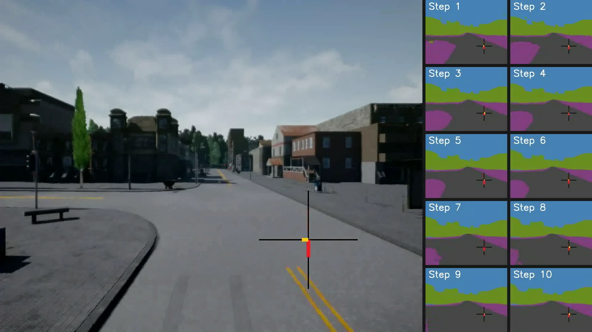
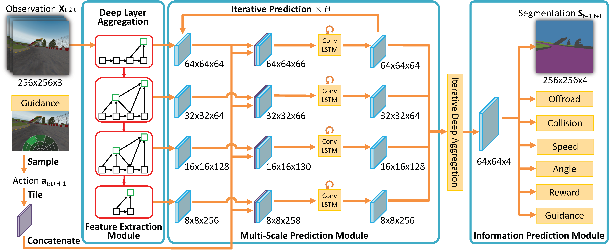

# Semantic Predictive Control for Explainable and Efficient Policy Learning
<p align="center"></p>
[paper](https://go.yf.io/spc-paper) / [video demo](https://youtu.be/FSrzyR8UhxM)

Semantic predictive control (SPC) is a policy learning framework that predicts future semantic segmentation and events by aggregating multi-scale feature maps.
It utilizes dense supervision from semantic segmentation for feature learning and greatly improves policy learning efficiency. 
The learned features are explainable as they depict future scenes with semantic segmentation and explicit events.

This repository contains a [PyTorch](https://pytorch.org/) implementation of SPC, as well as some training scripts to reproduce policy learning results reported in our paper.

- [Overview](#overview)
- [Training](#training)

## Overview
<p align="center"></p>
Our model is composed of four sub-modules: 

1. The feature extraction module extracts multi-scale intermediate features from RGB observations;
2. The extracted features are then concatenated with tiled actions and feed to the multi-scale prediction module that sequentially predicts future features; 
3. The information prediction module takes in the predicted latent feature representation and outputs corresponding future frame semantic segmentation and task-related signals, such as collision, off-road, and speed;
4. The guidance network module that predicts action distribution for efficient sampling-based optimization.  

## Training

Our results in the paper can be reproduced with the provided scripts by running
```bash
cd scripts/
bash train_#ENVNAME.sh
```
Together with the training scripts, simulator environments need to be activated:

### CARLA

#### CARLA v0.8

CARLA v0.8 is used in the [spc paper](https://go.yf.io/spc-paper). To train on CARLA v0.8, set the `env` parameter to be **carla8** and start the [CARLA simulator](http://carla.org/) first. Here is an example with default settings on Ubuntu

To train on CARLA, the [CARLA simulator](http://carla.org/) should be started first. Here is an example with default settings on Ubuntu
```
SDL_VIDEODRIVER=offscreen SDL_HINT_CUDA_DEVICE=0 ./CarlaUE4.sh -carla-settings=Example.CarlaSettings.ini -windowed -ResX=256 -ResY=256 -carla-server -carla-no-hud
```
Or on Windows
```
CarlaUE4.exe -windowed -ResX=800 -ResY=600 -carla-server -carla-no-hud -carla-settings=Example.CarlaSettings.ini
```

We provide a docker image to run spc on CARLA v0.8. It packages both carla simulator and spc client that can work around a [CARLA 8 issue](https://github.com/carla-simulator/carla/issues/263). To use the image

```shell
docker pull deepdrive/spc
docker run -it --runtime=nvidia [other_options] deepdrive/spc
```

Then run spc in the `spc` conda environment and start carla simulator by the script `carla_0.8.4/run.sh`.

#### CARLA v0.9

To use some advanced features provided in CARLA v0.9, we also support it but currently not recommended for stability issue. To train on carla v0.9, set the `env` parameter to be **carla9** . Only the versions later than v0.9.4 (included) are supported and v0.9.4 is preferred. To run on v0.9.5 or v0.9.6 check the file `envs/CARLA/world.py` to comment and uncomment some lines as guided.

We recommend to install carla client api for v0.9.4 with pip:

```
pip install carla==0.9.4
```

To start a CARLA9 simulator :

```shell
./CarlaUE4.sh [Map_option] -carla-server -world-port=xxx [other_options]
```

To help debug and training tracking, some advanced monitoring mechanisms are provided on carlav0.9. To enable them, set the flag `--monitor` or `--recording-frame` when booting the training.

*P.S. Carla v0.8 is the only stable version and recommended for spc. Some issue about interlock data racing might occur in the sync mode of carla v0.9. Please refer this [issue](https://github.com/carla-simulator/carla/pull/1803) to work around it.*

### TORCS and GTAV
To run spc on TORCS or GTAV, please check the README files in `external\_files` and the [PyTORCS](https://github.com/ucbdrive/pyTORCS) repo for instructions.


We provide a docker image to run spc. It packages both carla simulator and spc client that can work around a [CARLA 8 issue](https://github.com/carla-simulator/carla/issues/263). To use the image

```shell
docker pull deepdrive/spc
docker run -it --runtime=nvidia [other_options] deepdrive/spc
```

Then run spc in the `spc` conda environment and start carla simulator by the script `carla_0.8.4/run.sh`.

## Evaluation

To evaluate the model and to produce demo with the latest model saved, we can simply run *main.py* with the flag **--eval**. Then, to transform saved snapshot images to a demo video, simply run the script:

```
python merge_demo.py
```
